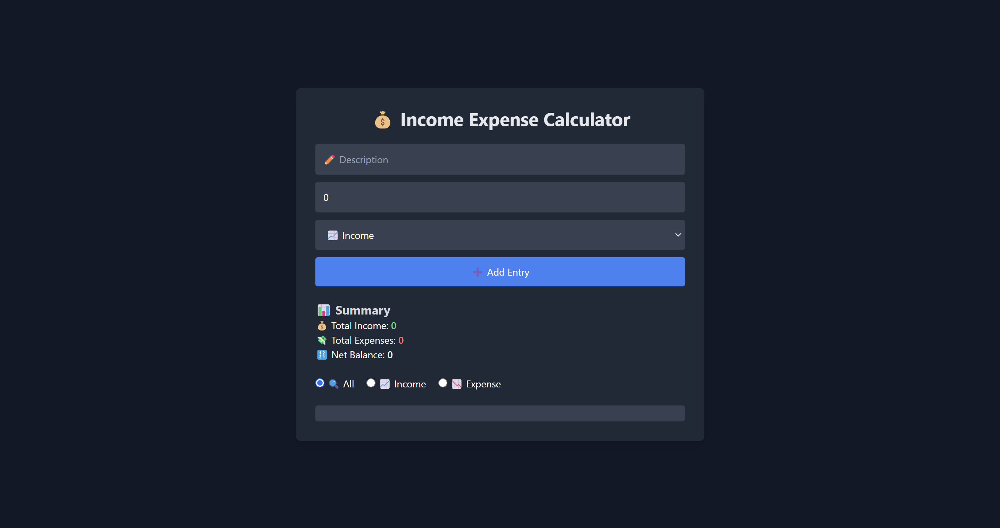

# 💰 Income Expense Calculator

## 📌 Overview
A simple yet powerful **Income Expense Calculator** that helps you track your finances effortlessly. Add, edit, and delete income or expense entries while maintaining a clear financial summary.

## 🚀 Features
- 📥 **Add** income and expense entries
- ✏️ **Edit** existing entries
- ❌ **Delete** entries
- 🔍 **Filter** by "All", "Income", or "Expense"
- 📊 **Real-time Summary**: View total income, expenses, and net balance
- 💾 **Local Storage** support for persistent data

## 🛠 Tech Stack
- **HTML**
- **Tailwind CSS**
- **JavaScript** 

## 📷 Screenshot


## 📦 Installation & Usage
1. Clone the repository:
   ```sh
   git clone 
   ```


